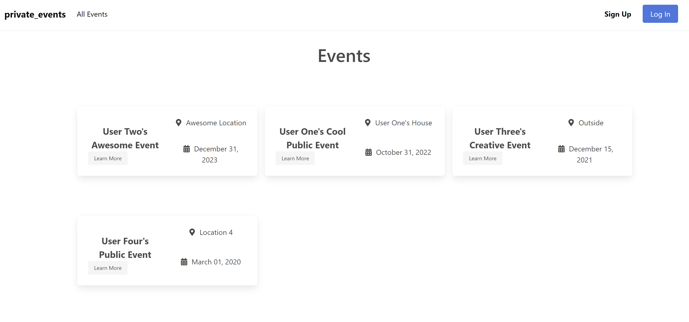
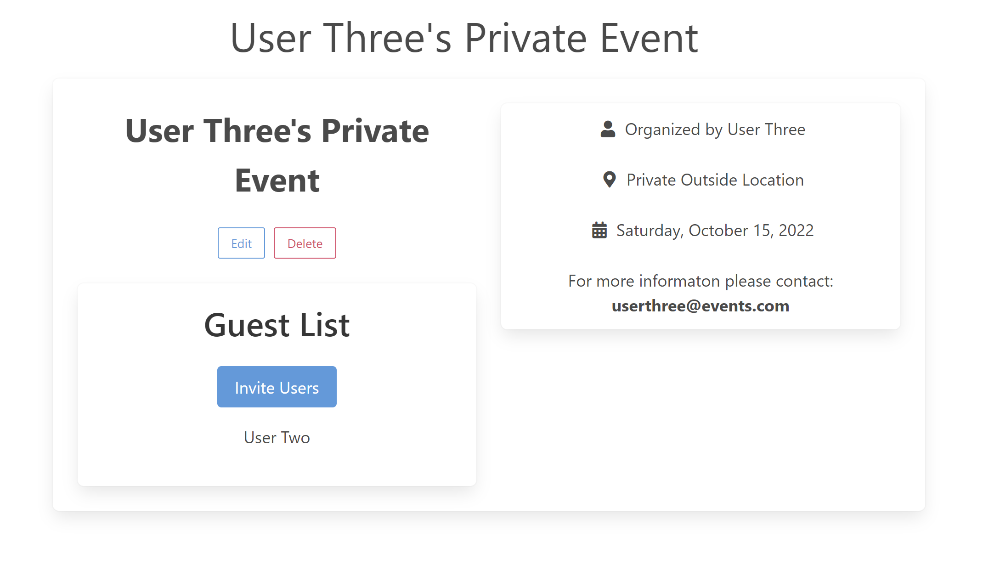
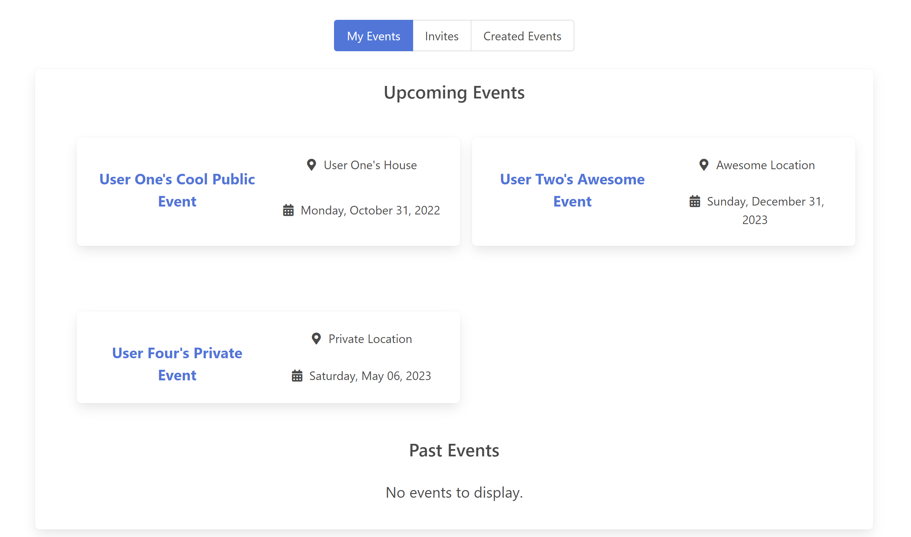
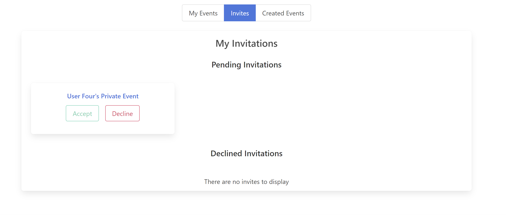
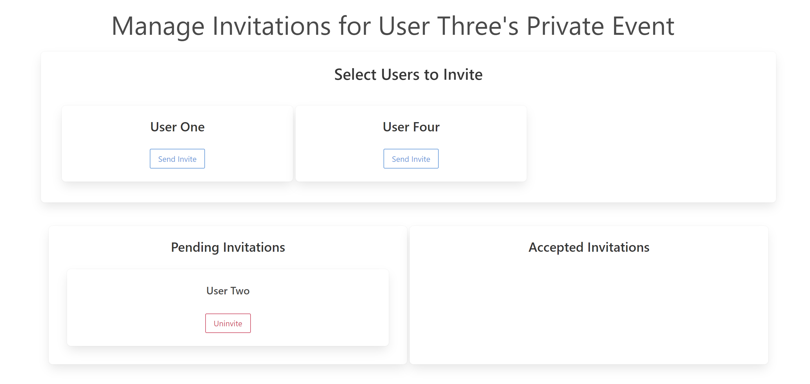

# Private Events
## Description
This is a project based off the prompt from [The Odin Ruby on Rails Learning Track](https://www.theodinproject.com/courses/ruby-on-rails/lessons/associations). The project was to set up an event creation site where authenticated users can create public and private events that other users can rsvp to. 

## Live Preview 
You can see a live version of this project [here](https://acel-private-event.herokuapp.com/).
You can create a new user ofr log into 'userone@events.com', 'usertwo@events.com', 'userthree@events.com' with a password of '123456' to test the functionality of the site.

## Functionality

You can see the index page without being logged in but cannot create an event unless you are authenticated

By clicking on learn more you will be able to see the full details of the event. This view is one of user viewing an event they created. If you were not the created you would see an option to rsvp to the event.

To view all of the events you are associated with you can click on the nav link 'My Events' this will give you tabs to see all of your rsvp'd events both past and upcoming events. This will also contain a link to open the event details page.

The 'Invites' tab will show you any pending invites to private events and the events you have declined the invitation.

When viewing the Event details page of  private event you have created you will have a link to invite users to the event. This will bring you to  page where you can select from a list of all users to invite. You can also see which users have accepted and which are still pending. 